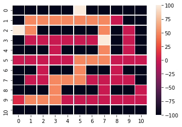

# Shortest path prediction with multiple stops using reinforcement learning

# What it is and how it works :  
The program finds the shortest path from a starting point to all the stops marked on the map. It finds the shortest path between the starting point to the nearest stop and then updates that stop as the next starting point and finds the next nearest stop. This process is repeated till all stops have been covered.  

# Map:

# Example 1:

starting_point: 
[9,0]

stops:
[[0,5], [2,0], [3,7]]

# Example 2:  

starting_point:
[5,10]

stops:
[[9,0], [2,9], [4,3]]

